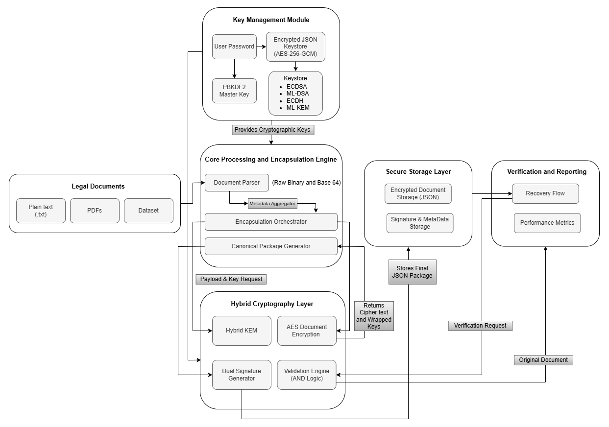
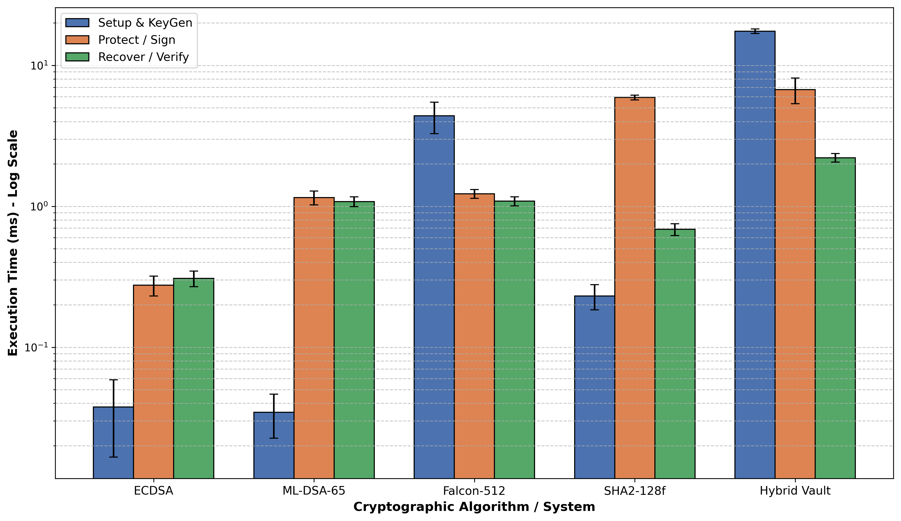

# Hybrid Post-Quantum Secure Encapsulation Vault

A hybrid cryptographic framework designed for the quantum-safe protection of legal documents. This repository contains the full open-source implementation used in our journal research, including the core security architecture, benchmarking scripts, and automated dataset processing pipelines.

## Overview

This framework provides both confidentiality and authenticity against "Harvest Now, Decrypt Later" (HNDL) quantum attacks. It relies on a "Defense-in-Depth" approach by logically combining NIST-standardized Post-Quantum Cryptography (PQC) with established classical algorithms.

**Core Cryptographic Suite:**
* **Key Encapsulation:** ML-KEM-768 (FIPS 203) + ECDH (SECP256R1)
* **Symmetric Encryption:** AES-256-GCM
* **Key Management (At-Rest):** PBKDF2-HMAC-SHA256 (100,000 iterations)
* **Digital Signatures:** ML-DSA-65 (FIPS 204) + ECDSA (SECP256R1)

*(Note: All PQC operations are executed via the `liboqs` C-backend, natively leveraging AVX2 hardware acceleration for optimal performance).*

---

## System Architecture



*(Above: The hybrid workflow demonstrating the logical AND-gate verification policy and AES-256-GCM encryption pipeline.)*

---

## Repository Structure

```text
Hybrid-Post-Quantum-Secure-Vault/
│
├── images/
│   ├── system_architecture.png                 # Architecture diagram
│   └── single_document_latency_breakdown.png   # End-to-end latency graph
├── pdf/
│   ├── benchmark_pdf.py                        # Automated metrics generation (3000 iterations)
│   ├── integrated_complete_system.py           # Full Sender → Receiver end-to-end simulation
│   ├── smart_contract_agreement.pdf            # Sample payload for testing
│   └── protected_documents/                    # Auto-generated output directory
│
├── dataset/
│   ├── dataset_dilithium.py                    # ML-DSA-65 bulk signing pipeline
│   ├── dataset_falcon.py                       # Falcon-1024 bulk signing pipeline
│   ├── dataset_sphincs.py                      # SPHINCS+ bulk signing pipeline
│   └── dataset_hybrid.py                       # Full Hybrid Vault bulk processing
│
└── README.md
```

---

## Installation & Requirements

### System Requirements

* **OS:** Ubuntu 20.04 / 22.04 LTS (Recommended for `liboqs` compilation)
* **Hardware:** x86-64 CPU with **AVX2 support** (Required for sub-millisecond lattice operations)
* **Software:** Python 3.8+

*Verify your CPU supports AVX2 by running:*

```bash
lscpu | grep -i avx2
```

### Step-by-Step Installation

**1. Install System Dependencies**

```bash
sudo apt update && sudo apt upgrade -y
sudo apt install -y python3 python3-pip python3-dev build-essential cmake ninja-build libssl-dev git
```

**2. Compile and Install `liboqs`**

```bash
git clone --depth 1 https://github.com/open-quantum-safe/liboqs.git
cd liboqs
mkdir build && cd build
cmake -GNinja -DCMAKE_BUILD_TYPE=Release ..
ninja
sudo ninja install
sudo ldconfig
cd ../..
```

**3. Install Python Dependencies**

```bash
pip3 install liboqs-python cryptography pypdf
```

**4. Verify Installation**

```bash
python3 -c "import oqs; s = oqs.Signature('ML-DSA-65'); print('ML-DSA: OK'); k = oqs.KeyEncapsulation('ML-KEM-768'); print('ML-KEM: OK')"
```

---

## Usage Guide

### 1. Integrated Secure Vault Demo (End-to-End)

Demonstrates the full lifecycle: Password-protected keystore generation, hybrid encapsulation/encryption, and dual-signature verification leading to payload recovery.

```bash
cd pdf/
python3 integrated_complete_system.py
```

### 2. Empirical Benchmarking

Runs 3,000 iterations per algorithm (with initial warm-up discards to prevent caching bias) to generate highly accurate latency and overhead metrics.

```bash
cd pdf/
python3 benchmark_pdf.py
```

*Outputs are saved as both `.csv` and `.json` files in the working directory.*

### 3. Dataset Scalability Processing

To test throughput against large-scale legal datasets, navigate to the dataset folder and run the respective pipeline:

```bash
cd dataset/
python3 dataset_hybrid.py
```

*Update the base_dataset_path variable at the top of main() in each dataset script to point to your local dataset directory. On running, the script will automatically list available dataset folders and prompt you to select one interactively.*

---

## Dataset Availability

The unstructured legal text dataset used for scalability benchmarking is publicly available on Zenodo: https://zenodo.org/records/7152317.

* **Format:** Plain text (`.txt`) to isolate raw byte payloads.
* **Partitions:** 100 documents, 693 documents, 7030 documents.

---

## Performance Results

Our evaluations confirm that the Hybrid Vault incurs highly manageable overhead, processing standard legal documents with sub-second recovery times.

### Benchmark Visualizations



*(Above: Detailed breakdown of total end-to-end execution time (Setup, Protect, and Recover phases) for processing a single legal document).*

---

## License

This project is licensed under the MIT License.

```
MIT License

Copyright (c) 2026

Permission is hereby granted, free of charge, to any person obtaining a copy
of this software and associated documentation files (the "Software"), to deal
in the Software without restriction, including without limitation the rights
to use, copy, modify, merge, publish, distribute, sublicense, and/or sell
copies of the Software, and to permit persons to whom the Software is
furnished to do so, subject to the following conditions:

The above copyright notice and this permission notice shall be included in all
copies or substantial portions of the Software.

THE SOFTWARE IS PROVIDED "AS IS", WITHOUT WARRANTY OF ANY KIND, EXPRESS OR
IMPLIED, INCLUDING BUT NOT LIMITED TO THE WARRANTIES OF MERCHANTABILITY,
FITNESS FOR A PARTICULAR PURPOSE AND NONINFRINGEMENT. IN NO EVENT SHALL THE
AUTHORS OR COPYRIGHT HOLDERS BE LIABLE FOR ANY CLAIM, DAMAGES OR OTHER
LIABILITY, WHETHER IN AN ACTION OF CONTRACT, TORT OR OTHERWISE, ARISING FROM,
OUT OF OR IN CONNECTION WITH THE SOFTWARE OR THE USE OR OTHER DEALINGS IN THE
SOFTWARE.
```
